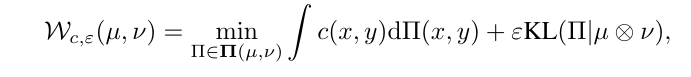

# Implementation of 'Distributional Reinforcement Learning with Regularized Wasserstein Loss' (NeurIPS 2024)

This repository contains the Pytorch implementation of our Sinkhorn Distributional RL paper "[Distributional Reinforcement Learning with Regularized Wasserstein Loss](https://arxiv.org/abs/2202.00769)". We include all distributional RL algorithms considered in our paper, including DQN, C51, QR-DQN, MMDDRL, and SinkhornDRL(ours).


<p align="center">
    
</p>

## Run the Code
### Step 1: Environment Setup: OpenAI Baselines, requirement.txt, and Atari Games

Install [OpenAI Baselines](https://github.com/openai/baselines), and then install dependency in `requirement.txt`.

```
git clone https://github.com/openai/baselines.git
cd baselines
pip install -e .
```

### Step 2: Run Distributional RL algorithms on 55 Atari Games

We take the Breakout environment as an example. Run the following code respectively and then plot the learning curves. (Note: `--multi 0` by default)

```
python main.py --game breakout --method DQN --iter 10000000 --seed 1 --gpu 1
python main.py --game breakout --method C51 --iter 10000000 --seed 1 --gpu 1
python main.py --game breakout --method QRDQN --iter 10000000 --seed 1 --gpu 1
python main.py --game breakout --method MMD --iter 10000000 --seed 1 --gpu 1
python main.py --game breakout --method Sinkhorn --iter 10000000 --niter_sink 10 --epsilon 10 --samples 200 --seed 1 --gpu 1
```


### Step 3: Run Distributional RL algorithms on five Atari Games in the Multi-dimensional Setting


```
python main.py --game Asteroids --method MMD --iter 10000000 --multi 1 --seed 1 --gpu 0
python main.py --game Asteroids --method Sinkhorn --iter 10000000 --multi 1 --seed 1 --gpu 1
```

We consider five Atari games with multi-dimensional rewards: `AirRaid, Asteroids, Gopher, MsPacman, UpNDown, and Pong`. For the reward decomposition method, please refer to the file `reward-compose`.


## Acknowledgement

This implementation is adapted from [ShangtongZhang's Modularized Implementation of Deep RL Algorithms](https://github.com/ShangtongZhang/DeepRL). Our implementation in the multi-dimensional setting is adapted from the [original implementation](https://github.com/zpschang/MD3QN) of the paper [Distributional Reinforcement Learning for Multi-Dimensional Reward Functions](https://arxiv.org/pdf/2110.13578) (NeurIPS 2021).

## Contact

Please contact ksun6@ualberta.ca if you have any questions.

## Reference
Please cite our paper if you use our implementation in your research:
```
@inproceedings{sun2024distributional,
  title={Distributional Reinforcement Learning with Regularized Wasserstein Loss},
  author={Sun, Ke and Zhao, Yingnan and Liu, Wulong and Jiang, Bei and Kong, Linglong},
  booktitle={Advances in Neural Information Processing Systems},
  year={2024}
}
```
